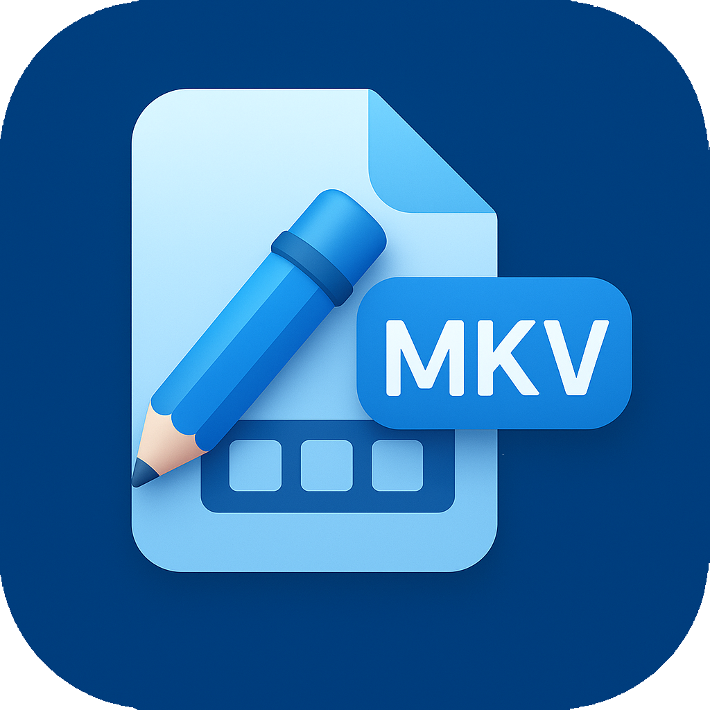

# MKV Track Tool

[繁體中文](README.md) | [简体中文](README.zh-CN.md) | [English](README.en.md) | **日本語**

シンプルで効率的、かつオープンソースのクロスプラットフォームMKVトラック管理ツール（Windows / macOS 対応）。
面倒なMKVファイルのトラック整理を解決するために設計されており、特定の言語トラックの一括削除や、デフォルトの音声/字幕の設定をサポートし、直感的なリアルタイムプレビュー機能を提供します。



## ✨ 主な機能

-   **直感的な操作**：ドラッグ＆ドロップに対応し、すべての映像、音声、字幕トラックを自動的にスキャンして一覧表示します。
-   **一括処理**：
    -   **ワンクリック削除**：不要な言語トラックを素早く削除（例：日本語音声を残し、他を削除）。
    -   **デフォルト設定**：特定の言語の音声または字幕を「デフォルトトラック (Default)」として一括設定。
    -   **属性変更**：トラックの「強制 (Forced)」および「デフォルト (Default)」フラグの変更をサポート。
-   **リアルタイムプレビュー**：操作ボタンにマウスを合わせると、削除または変更されるトラックがリアルタイムでハイライト表示され、安心して操作できます。
-   **安全な出力**：処理後のファイルはデフォルトで `processed` サブフォルダに保存され、元のファイルを上書きすることはありません。
-   **モダンなインターフェース**：Vue 3 + Tailwind CSS で構築された質感のあるインターフェース。macOSのライト/ダークモード（システム準拠）を完全にサポート。
-   **多言語対応**：繁体字中国語、簡体字中国語、英語、日本語を標準サポート。

## 📥 インストール

### macOS ユーザーへの注意

本ソフトウェアは Apple 開発者署名を受けていないため（個人の独立開発者であるため）、macOS でインストールして最初に開く際に **「アプリケーションが破損しているため開けません」** というエラーが表示される場合があります。これは macOS のセキュリティメカニズムによるもので、ソフトウェアが実際に破損しているわけではありません。

ターミナル (Terminal) を開き、以下のコマンドを実行して修復してください：

```bash
sudo xattr -r -d com.apple.quarantine /Applications/MKV\ Track\ Tool.app
```

実行後にパスワードを入力すると、正常に開けるようになります。

### Windows

対応するインストーラー (`.exe`) をダウンロードして実行してください。

## 🚀 クイックスタート

1. **ファイルを追加**：処理したい MKV ファイルをアプリウィンドウにドラッグするか、「ここにファイルをドラッグ」エリアをクリックして選択します。
2. **一括設定** (左サイドバー)：
    - **ターゲット言語を選択**：例えば「Japanese (ja)」を選択。
    - **トラックタイプを選択**：例えば「音声 (Audio)」を選択。
    - **操作を実行**：「デフォルトに設定」または「一括削除」をクリック。
3. **個別调整** (右リスト)：
    - リスト内の個々のトラックの「保持」スイッチや、「デフォルト/強制」タグを手動で切り替えることもできます。
4. **処理開始**：右上の「処理開始」ボタンをクリックします。
5. **完了**：処理されたファイルは、元のファイルパスにある `processed` フォルダに保存されます。

## 🛠️ 技術スタック

このプロジェクトは、以下の最新の Web 技術を使用して構築されています：

-   **コアフレームワーク**：[Electron](https://www.electronjs.org/)
-   **フロントエンド**：[Vue 3](https://vuejs.org/) (Composition API)
-   **言語**：[TypeScript](https://www.typescriptlang.org/)
-   **ビルドツール**：[Vite](https://vitejs.dev/)
-   **状態管理**：[Pinia](https://pinia.vuejs.org/)
-   **多言語化**：[Vue I18n](https://vue-i18n.intlify.dev/)
-   **基盤ツール**：[MKVToolNix](https://mkvtoolnix.download/) (mkvmerge)

## ☕ 開発をサポート

このツールが役立った場合は、コーヒーを一杯奢っていただけると、今後の開発とメンテナンスの励みになります！

<a href="https://www.buymeacoffee.com/junyou" target="_blank"></a>

## 📄 ライセンス

MIT License
